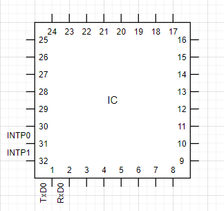
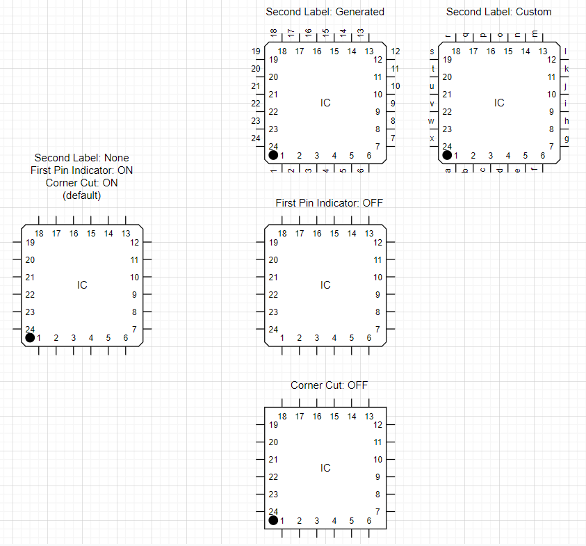

About
-----
This repository is forked from jgraph/drawio in order to address the issue with regard to Quad Flat Package IC under the shape library, Electrical / Logic Gates.

Issue
-----
Labels overlap each other when Pin label type is Custom. 
First pin indicator(black dot) occupies some unnecessary space.

Solution
--------
Add the following property to Quad Flat Package IC.
- Draw custom label above the lead of the pin.
- Draw first pin indicator or not.

Additionally
- Cut the corner or simple rectangle, since this cut is not always the case for IC.

Pattern
--------

